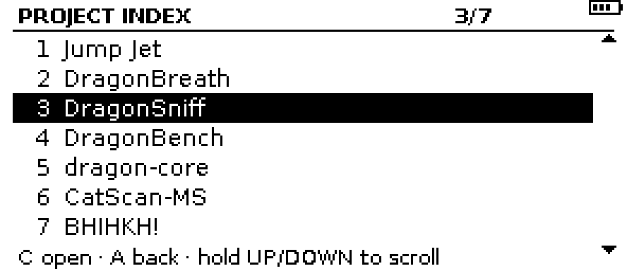
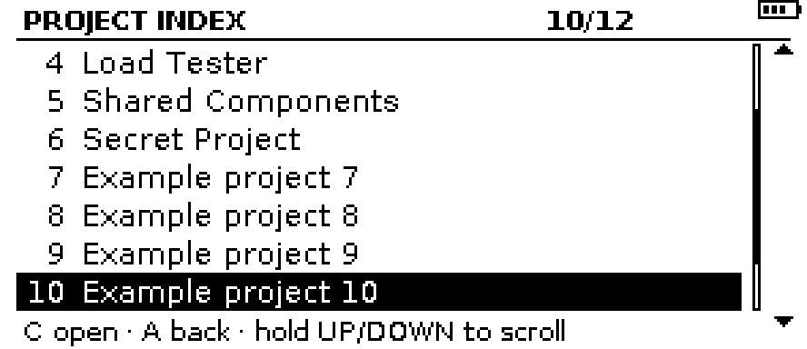

# Badger? I hardly knew her! (BHIHKH!)


**Badger? I hardly knew her! (BHIHKH!)**, occasionally BadgHer, is a photo badge,
digital business card and project portfolio for conferences, trade shows and
meetups, written as native C/C++ firmware for the **original Pimoroni Badger 2040** (RP2040, 296 × 128
monochrome e-paper, five front buttons, USB-C, battery connector). It uses the
Raspberry Pi Pico SDK and Pimoroni's C++ UC8151 driver. No MicroPython, no
Arduino.

The same firmware also builds natively for the **Pimoroni Badger 2350**
(RP2350A, 264 × 176 e-paper; working name BadgHer™ NEO, name not final), with
its own panel backend and layouts: `-DBHIHKH_TARGET=badger2350`
([docs/BUILD.md](docs/BUILD.md#hardware-target), [docs/INSTALL.md](docs/INSTALL.md#badger-2350)). That target is CI-built and
host-tested, but **not yet validated on a physical badge**
([checklist](docs/BADGER2350_SMOKE_TEST.md)).

| Photo badge (layout A, default) | Business card |
|---|---|
|  |  |

The previews above use the public sample content: a fictional person, a
placeholder silhouette instead of a photo, fictional projects and
`example.com` destinations. Your name, portrait, event label, contacts and
portfolio are your own configuration ([Make it yours](#make-it-yours)), kept
out of Git (see [Private content](#private-content)).

## Screens and controls

| Button | Short press | Long press (≥ 1 s) |
|---|---|---|
| **A** | Photo badge | Clean full refresh (removes ghosting) |
| **B** | Business card | On the card: full-screen contact QR (if configured) · on a project: that project's repository QR (if it has a link) · on a QR: back |
| **C** | Project portfolio, at the last project viewed (if any are configured). **Double press**: project index | Project 1 (from anywhere, including a project QR) |
| **UP / DOWN** | Previous / next project; from a full-screen QR, back to the card or project | UP: **gesture mode** on/off · DOWN: power off now |
| **USR** | Diagnostics screen | Switch layout A ↔ B for this session |

**Project index** (double C): a list of the project names with the
last-viewed one highlighted. UP/DOWN move the highlight; hold to scroll
(it stops at the ends). Holding DOWN for 3 s powers off from the index (1 s
is taken by scrolling). **C** opens the highlighted project at once; **A**
cancels back to where you were, without changing the remembered project;
long C opens project 1. Browsing is quiet: the highlight moves in memory and
the panel is refreshed once the buttons pause (about 0.3 s after release),
not for every step. A highlight change still takes an e-paper refresh. A
single short C waits about 0.35 s before acting, to tell it apart from a
double press. Pressing another button during that wait decides it in one
step: long B shows the remembered project's QR, while A, B or USR short go
to their own screen without drawing the project first. See
[docs/ARCHITECTURE.md](docs/ARCHITECTURE.md#buttons-c-gestures-and-the-project-index).

| Project index (sample) | Index at 12 entries (labelled placeholders) |
|---|---|
|  |  |

- **Project portfolio**: up to 12 configurable entries (`projectN.*` keys),
  each a page with title, tagline, description, optional status tag and a
  `PROJECT n/N` counter. An entry with a `link` offers its repository as a
  full-screen QR (long B); an entry without one, such as a teaser with a
  `banner`, never shows a QR. Browsing (pages or the index) never writes to
  flash.
- **Contact icons**: card lines typed `github` or `discord` show a small
  monochrome icon instead of the platform name (Simple Icons, CC0; see
  [docs/LICENSES.md](docs/LICENSES.md)). Untyped lines keep their text label.
- The badge boots to the photo badge. When woken from battery power-off by B
  or C, it opens the card or projects instead (`wake.selects_screen`).
- Screens change only on deliberate button presses, swipes (gesture mode)
  or USB commands, never on a timer.
- **Gesture mode** (optional APDS-9960 on Qwiic): swipe right/left for the
  next/previous screen, up for the card (again for the QR), down for the
  badge. It is off by default, the sensor and its IR emitter are powered down
  whenever it is off, and a missing sensor never affects the rest of the
  badge. See [docs/GESTURE.md](docs/GESTURE.md).
- **Status area** (top right on every screen): battery bars for a
  single-cell LiPo, `LOW`, `?` for an invalid reading, or `USB` on USB power
  (never "charging": the board has no charger), plus the gesture
  indicator. See [docs/BATTERY.md](docs/BATTERY.md).
- Holding a button through a battery wake never counts as a long press.
- On battery the badge powers itself off after `sleep.timeout_s` (default
  120 s) of inactivity. It first returns to the photo badge (`sleep.screen`),
  and the e-paper keeps that image with no power. Any front button wakes it
  with a cold boot.

## Quick start

```bash
scripts/fetch-deps.sh          # pinned pico-sdk 2.3.1, pimoroni-pico v1.29.0-2, picotool 2.3.1
scripts/run-host-tests.sh      # host unit/render/QR tests + previews (no hardware), both badges
scripts/build-firmware.sh      # Badger 2040 (RP2040) cross-build -> build/fw/badger_badge.uf2
# Badger 2350: scripts/build-firmware.sh -DBHIHKH_TARGET=badger2350 -> build/fw-badger2350/badger2350_badge.uf2
```

Then hold **BOOT/USR**, tap **RST**, and copy `build/fw/badger_badge.uf2`
onto the `RPI-RP2` drive. **Read [docs/INSTALL.md](docs/INSTALL.md) first:
this replaces MicroPython/BadgerOS, and the badge's settings writes
eventually overwrite BadgerOS files.**

Configure over USB (see [docs/USB_CLI.md](docs/USB_CLI.md)):

```bash
python3 tools/badgerctl.py push local/profile.json      # validated, then committed to flash
python3 tools/badgerctl.py cmd "set qr.payload https://example.com/you"
python3 tools/badgerctl.py cmd commit
```

## Make it yours

Fill in a form, add your photo, build. No C++ or JSON editing:

```bash
scripts/build-badge.sh --new                       # 1. copy the template to local/badge.toml (private)
#   2. fill in local/badge.toml: name, title, contacts, QR, projects (every field is explained there)
#   3. put your photo next to it (local/photo.jpg) and set: [portrait] photo = "photo.jpg"
scripts/build-badge.sh --preview local/badge.toml  # 4. check every screen: local/out/badge/previews/contact_sheet.png
scripts/build-badge.sh local/badge.toml            # 5. firmware: local/out/badge/fw/badger_badge.uf2
```

The one command validates the form (errors name the field and the fix),
converts the photo (the original is only read), checks that every field
is drawn whole on every screen, decodes every QR code from the rendered
screens, and only then cross-compiles and checks the firmware. On Windows,
run it in WSL2 and open the form and previews through `\\wsl$\...`. See
[docs/PERSONALIZE.md](docs/PERSONALIZE.md) for the details, Windows notes and
moving an existing `local/profile.json` to a form (`badge_form.py export`).

## Private content

Git ignores `local/`. Put these there:

- `local/badge.toml`: your filled-in form, and your photo next to it.
  Generated files (profile, portrait, previews, firmware) go to
  `local/out/<form name>/`.
- `local/private/`: original photos. Never modified by the tools.
- `local/portrait.png`: the processed 1-bit portrait
  (`tools/portrait.py`, see [docs/DESIGN.md](docs/DESIGN.md)).
- `local/profile.json`: a profile written as JSON (the previous workflow,
  still supported). Copy `config/sample-profile.json` as a starting point.
- `local/backups/`: `scripts/private-backup.sh create [local/badge.toml]`
  writes a private archive here. It holds the inputs, the personalised firmware built from a
  clean commit, a `git bundle` of the source, checksums and RESTORE.md.
  `scripts/private-backup.sh verify <archive>` restores it into a temporary
  directory, rebuilds, and confirms the firmware is byte-identical.

If `local/profile.json` and `local/portrait.png` exist, a plain
`scripts/build-firmware.sh` embeds them automatically; a form is built with
`scripts/build-badge.sh`. CI always builds the public sample and the
generic form template. The portrait can also be shipped separately as
`badger_badge-assets.uf2`, so a public firmware image never needs to contain
the photo.

## Documentation

- [docs/PERSONALIZE.md](docs/PERSONALIZE.md): the fill-in form, one-command build, previews, Windows/WSL
- [docs/BUILD.md](docs/BUILD.md): Linux and Windows/WSL builds, pinned versions, CI
- [docs/INSTALL.md](docs/INSTALL.md): backup, flashing, BadgerOS impact, configuration, battery, recovery
- [docs/USB_CLI.md](docs/USB_CLI.md): serial commands and every configurable key
- [docs/ARCHITECTURE.md](docs/ARCHITECTURE.md): modules, dual-core pipeline, refresh policy, power and recovery
- [docs/FORMATS.md](docs/FORMATS.md): flash map, settings records, asset packs, profile JSON
- [docs/DESIGN.md](docs/DESIGN.md): layout candidates, portrait conversion comparison, QR rules
- [docs/GESTURE.md](docs/GESTURE.md): APDS-9960 wiring, power, calibration, aperture
- [docs/BATTERY.md](docs/BATTERY.md): battery circuit, thresholds, sampling, multimeter validation
- [docs/REFRESH.md](docs/REFRESH.md): why a full refresh flashes, refresh timing and `diag refresh`
- [docs/HARDWARE_SMOKE_TEST.md](docs/HARDWARE_SMOKE_TEST.md): checks to run on a physical badge
- [docs/USB_HARDWARE_CHECKLIST.md](docs/USB_HARDWARE_CHECKLIST.md): blank USB-only checklist (no battery / sensor) for any badge
- [docs/test-records/](docs/test-records/README.md): dated hardware test results, each with its firmware commit, provenance and limits
- [docs/REVIEW.md](docs/REVIEW.md): code-review findings, fixes and remaining limitations
- [docs/LICENSES.md](docs/LICENSES.md): dependency, font and asset licence inventory
