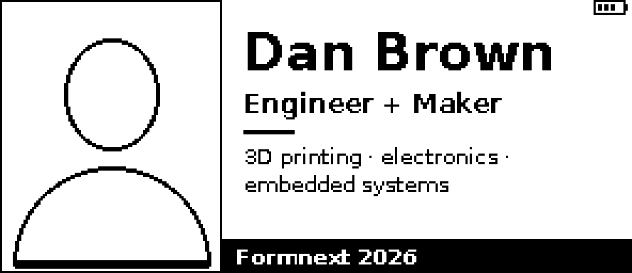
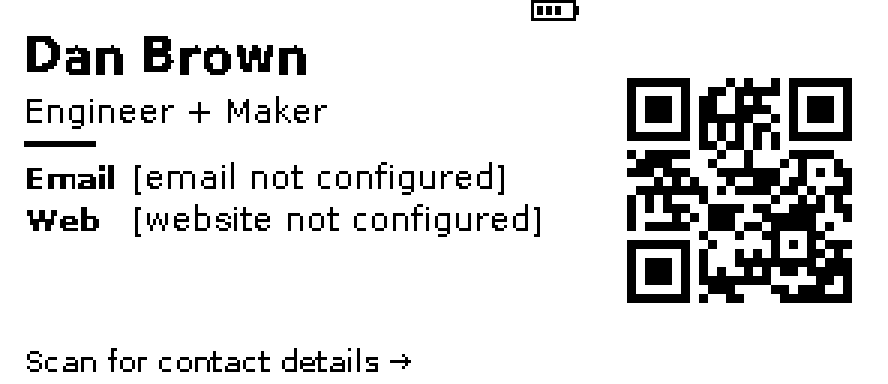

# Badger? I hardly knew her!

A photo badge and digital business card for **Formnext 2026**, written as native
C/C++ firmware for the **original Pimoroni Badger 2040** (RP2040, 296 × 128
monochrome e-paper, five front buttons, USB-C, battery connector). It uses the
Raspberry Pi Pico SDK and Pimoroni's C++ UC8151 driver. No MicroPython, no
Arduino.

| Photo badge (layout A, default) | Business card |
|---|---|
|  |  |

The previews above use the public sample content: a placeholder silhouette
instead of a photo, and an `example.com` QR destination. The real portrait and
contact details are kept out of Git (see [Private content](#private-content)).

## Screens and controls

| Button | Short press | Long press (≥ 1 s) |
|---|---|---|
| **A** | Photo badge | Clean full refresh (removes ghosting) |
| **B** | Business card | Full-screen QR (if a QR destination is configured) |
| **C** | Projects (if any are configured) | Diagnostics screen |
| **UP / DOWN** | Previous / next project; from the full-screen QR, back to the card | UP: **gesture mode** on/off · DOWN: power off now |
| **USR** | – | Switch layout A ↔ B for this session |

- The badge boots to the photo badge. When woken from battery power-off by B
  or C, it opens the card or projects instead (`wake.selects_screen`).
- Screens change only on deliberate button presses, swipes (gesture mode)
  or USB commands, never on a timer.
- **Gesture mode** (optional APDS-9960 on Qwiic): swipe right/left for the
  next/previous screen, up for the card (again for the QR), down for the
  badge. It is off by default, the sensor and its IR emitter are powered down
  whenever it is off, and a missing sensor never affects the rest of the
  badge. See [docs/GESTURE.md](docs/GESTURE.md).
- **Status area** (top right on every screen): battery bars for a
  single-cell LiPo, `LOW`, `?` for an invalid reading, or `USB` on USB power
  (never "charging": the board has no charger), plus the gesture
  indicator. See [docs/BATTERY.md](docs/BATTERY.md).
- Holding a button through a battery wake never counts as a long press.
- On battery the badge powers itself off after `sleep.timeout_s` (default
  120 s) of inactivity. It first returns to the photo badge (`sleep.screen`),
  and the e-paper keeps that image with no power. Any front button wakes it
  with a cold boot.

## Quick start

```bash
scripts/fetch-deps.sh          # pinned pico-sdk 2.2.0, pimoroni-pico v1.29.0-2, picotool 2.2.0
scripts/run-host-tests.sh      # host unit/render/QR tests + previews (no hardware)
scripts/build-firmware.sh      # RP2040 cross-build -> build/fw/badger_badge.uf2
```

Then hold **BOOT/USR**, tap **RST**, and copy `build/fw/badger_badge.uf2`
onto the `RPI-RP2` drive. **Read [docs/INSTALL.md](docs/INSTALL.md) first:
this replaces MicroPython/BadgerOS, and the badge's settings writes
eventually overwrite BadgerOS files.**

Configure over USB (see [docs/USB_CLI.md](docs/USB_CLI.md)):

```bash
python3 tools/badgerctl.py push local/profile.json      # validated, then committed to flash
python3 tools/badgerctl.py cmd "set qr.payload https://example.com/you"
python3 tools/badgerctl.py cmd commit
```

## Private content

Git ignores `local/`. Put these there:

- `local/private/`: original photos. Never modified by the tools.
- `local/portrait.png`: the processed 1-bit portrait
  (`tools/portrait.py`, see [docs/DESIGN.md](docs/DESIGN.md)).
- `local/profile.json`: your real profile. Copy
  `config/sample-profile.json` as a starting point.

If these files exist, a local build embeds them automatically; CI always
builds the public sample. The portrait can also be shipped separately as
`badger_badge-assets.uf2`, so a public firmware image never needs to contain
the photo.

## Documentation

- [docs/BUILD.md](docs/BUILD.md): Linux and Windows/WSL builds, pinned versions, CI
- [docs/INSTALL.md](docs/INSTALL.md): backup, flashing, BadgerOS impact, configuration, battery, recovery
- [docs/USB_CLI.md](docs/USB_CLI.md): serial commands and every configurable key
- [docs/ARCHITECTURE.md](docs/ARCHITECTURE.md): modules, dual-core pipeline, refresh policy, power and recovery
- [docs/FORMATS.md](docs/FORMATS.md): flash map, settings records, asset packs, profile JSON
- [docs/DESIGN.md](docs/DESIGN.md): layout candidates, portrait conversion comparison, QR rules
- [docs/GESTURE.md](docs/GESTURE.md): APDS-9960 wiring, power, calibration, aperture
- [docs/BATTERY.md](docs/BATTERY.md): battery circuit, thresholds, sampling, multimeter validation
- [docs/HARDWARE_SMOKE_TEST.md](docs/HARDWARE_SMOKE_TEST.md): checks to run on a physical badge
- [docs/LICENSES.md](docs/LICENSES.md): dependency, font and asset licence inventory
