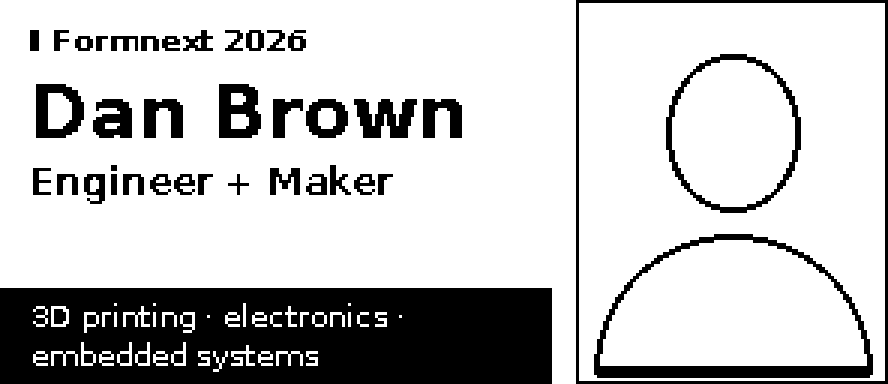

# Design notes

All previews come from the firmware renderer compiled for the host
(`host/preview.cpp`). They use the same fonts, coordinates and framebuffer
bits the badge sends to the panel. `docs/previews/native/` holds 296 × 128
images at native size; `x3/` holds 3× nearest-neighbour enlargements.

## Layout candidates

| A: portrait left (default) | B: portrait right |
|---|---|
|  |  |

- **A** puts a 104 × 128 portrait flush left. Next to it, the name is set in
  bold 24 px, falling back to 20 and then 17 px condensed before ellipsizing.
  Below that come the title in bold 12 px, the affiliation, a short rule, and
  the interests in 10 px. The event name sits in a black strip along the
  bottom of the text column.
- **B** mirrors the portrait to the right. It opens with a small event
  kicker, and the interests sit white-on-black in a band anchored to the
  bottom edge.

**Chosen default: A.** Both give the name the same 174 px column. A reads
left to right from face to name, which puts the most recognisable element
first. The name is the first text line, with nothing competing above it,
and the strong black element (the event strip) stays at the bottom, away
from the face. B remains available as
`layout 1`, and a long press on UP swaps layouts for the session, so both
can be compared on the real panel.

Every screen reserves a 56 × 8 px status area at the top right of its main
column, with no content rows 0–7 there. It holds the battery meter and the
gesture indicator (`build/previews/*/status_states_x6.png`). A host test
renders every screen with worst-case text and checks that the area stays
free and that the status never draws outside it.

Long titles wrap onto two lines of the same bold font instead of shrinking,
e.g. "Principal Mechanical Design / Engineer".

Screens without a portrait asset fall back to a full-width text layout.
Empty optional fields (affiliation, interests, event, contacts, project
tagline/status/banner/link) are skipped entirely: no labels, rules or gaps are left behind.
A card with no contacts shows only the identity block. Project taglines
that do not fit one line wrap onto two lines of bold 10 instead of being cut.

`scripts/run-host-tests.sh` also writes `build/previews/diagnostic-max/`, a
**HOST DIAGNOSTIC SAMPLE**. Every text field is filled to its byte limit with
labelled filler, with LOW battery, a gesture fault and fault-state
diagnostics. It checks layout limits; it is not content.

## Portrait conversion

Source: the owner's current studio headshot (1254 × 1254, light background),
kept byte-identical in `local/private/`. The previous portrait and its
settings are kept in `local/private/previous-portrait-v1/`. Nothing here is
committed: Git ignores `local/`.

Settings (`local/private/portrait.json`, crop is x, y, width, height):

```json
{"crop": [250, 10, 800, 985], "size": [104, 128], "white_pct": 14, "black_pct": 2,
 "gamma": 0.6, "sharpen": 1.0, "method": "atkinson"}
```

The pipeline is unchanged: crop at the target's 104:128 aspect, downscale in
linear light (so the thin glasses frames keep their weight), apply a mild
unsharp mask, apply global levels (2 % / 14 % clip), apply gamma, then
convert to 1 bit. Only global tone and geometric operations are used;
nothing is painted, retouched or synthesised.

Choices, compared at native resolution and 3×
(`local/previews/portrait-v2/crop_comparison_x3.png`,
`tone_comparison_x3.png`):

- **Crop.** Three framings were compared: a closer crop, head and shoulders
  (chosen) and a wider one. The closer crop pushes the hair against the top
  edge. The wider one makes the face and glasses smaller, leaving fewer
  pixels for the eyes. The chosen crop shows the whole head of longer hair
  with a little margin, the glasses at full width, and the jacket collar at
  the bottom.
- **Gamma.** 0.6 instead of the previous 0.7. On this photo, 0.7 makes the
  hair and the shadow side of the face noticeably heavier. 0.5 lightens the
  skin stipple until the face starts to lose shape. A 20 % white clip
  differed little from 14 %, so 14 % was kept.

| Method | Result on this photo |
|---|---|
| Otsu threshold | Glasses very clear, but the hair becomes a solid helmet and the face flattens into an outline. |
| Bayer 8×8 ordered | Visible cross-hatch over the face and hair; the glasses break up. |
| Floyd–Steinberg | Most tonal detail, but worm-like texture in the hair and dense speckle on the skin at 1:1. |
| **Atkinson** (chosen) | Highlights stay clean, the skin is lightly stippled, the hair keeps strands and volume, and the glasses, eyes and mouth stay distinct. |

## Contact icons

Typed `github` and `discord` contact lines show a 12 × 12 monochrome icon in
the label column instead of the words "GitHub"/"Discord", so the line is
only the username. The icons come from Simple Icons (CC0, see
LICENSES.md). `tools/iconsgen.py` rasterises them, with no reshaping, using a
small SVG path parser and a supersampled non-zero fill. Its `--check` mode
keeps `firmware/generated/icons.cpp` reproducible.

- The icon sits at the label column's left edge, 1 px below the line top, so
  it is centred on the value's cap height. Values keep one shared left edge
  and the 14 px line pitch. A host test checks the exact bitmap position.
- Other lines keep their bold text label. The type is explicit: a line
  labelled "GitHub" with no `type` gets no icon, so older profiles render as
  before.
- At 12 px the GitHub mark reduces to its round silhouette with the
  Octocat's tail at the lower left, and Discord's to the rounded "controller"
  face with two eyes. Both read as their platforms on the native-resolution
  previews. Legibility at arm's length on the panel is still to be checked
  (pending: physical test).

## Project portfolio

C opens the portfolio at the project viewed last; UP/DOWN browse (wrapping);
long B on a project with a `link` shows its repository QR, and long B or
UP/DOWN there returns to that same project. Each page has:

- a header with `PROJECT n/N`, left of the reserved status area;
- the title (bold, auto-sized);
- an optional teaser **banner**, white on a black band. The CatScan-MS
  entry uses it ("TOP SECRET - COMING SOON") and deliberately has no link
  and no QR;
- the tagline, always bold 10 so the hierarchy does not shift while
  browsing, up to 2 lines;
- an optional outlined **status** tag: a readiness note or the fork's
  upstream, never a version number (versions go stale on a badge that is
  not reflashed);
- the description in 11 px, falling back to 10 px before anything is cut;
- a footer with a compact label (`owner/repo` for GitHub links), plus a
  small QR glyph and "hold B" when a QR is available. Pages without a link
  have no footer at all.

The QR page re-encodes the project's own full `https://` link on every
render, so it can never show a previous project's code. Next to it, the
page shows the same compact `owner/repo` label, wrapped after `/`.

**Everything configured must fit.** `tools/render_previews.py` asks the
renderer (`badger_preview --fit`) whether each title, tagline, status,
description and link label of every configured project was drawn
completely, and fails if any was ellipsized or dropped. A host test applies
the same check to the sample portfolio and requires 11 px descriptions.
Only the labelled HOST DIAGNOSTIC SAMPLE is allowed to overflow, because
that is what it tests. With a status tag, about 80 characters of
description fit at 11 px.

### Portfolio sources

Text, links and status labels come from each selected repository's public
README and history; nothing beyond them is claimed. Destinations were
checked to resolve (`git ls-remote`) and every QR is decoded and compared
with its link.

| Entry | Destination | Notes |
|---|---|---|
| Jump Jet | thetechbenders/JumpJet | Co-developed by Dan and Mauker; redesign of Philip Sørensen's original Jetpack; PCBWay-sponsored (README). README states "cold-safe foundation", shown as "Work in progress". |
| DragonBreath | danielbrownjr/DragonBreath (Dan's fork) | Upstream **plastikman/DragonBreath** (maintainer plastikman, Zak Peirce; contributors include Justin Hayes). The badge says "Fork of plastikman/DragonBreath". Dan's contributions, merged upstream via PRs #89, #91, #97 and #98: opt-in Bambu external-chamber regulation, chamber control ported to dragon-core's `dc_pid`, PID duty telemetry, plus related fixes, tests and a build requirement. |
| DragonSniff | thetechbenders/DragonSniff | Read-only observability tooling (README). |
| DragonBench | thetechbenders/DragonBench | Characterization image, no actuator support (README). |
| dragon-core | danielbrownjr/dragon-core (Dan's fork) | Upstream **justinh-rahb/dragon-core** (maintainer justinh-rahb, Justin Hayes; contributors include Zak Peirce). The badge says "Fork of justinh-rahb/dragon-core". Dan's contributions, merged upstream via PRs #47, #49, #51, #54 and #55: the actuator-agnostic `dc_pid` PID primitive, expiry of stale Bambu/Prusa status data, redaction of Bambu device identifiers from logs, lower console-endpoint peak memory. |
| CatScan-MS | none | Teaser only: no link, no QR, no QR hint. |
| BHIHKH! | thetechbenders/badger-i-hardly-knew-her | This firmware; always the last entry. |

As checked on 2026-10-01, the forks' default branches trail upstream (DragonBreath's fork
`main` is at the #91 merge of 2026-09-04; dragon-core's at v0.28.2 while
upstream is at v0.35.2). The badge links the forks because the portfolio
shows Dan's own work; syncing the forks is up to their owner.

The font generator measures advances in FreeType's monochrome mode
(`mode="1"`), matching the 1-bit glyphs it stores. Antialiased advances had
left visible gaps inside words ("Instrum entation").

## QR codes

- Encoded on the badge with Nayuki qrcodegen from `qr.payload`, so a code
  always matches the configured text. The QR code is never drawn from a stored
  image.
- Error correction M (raised automatically when free), falling back to L only
  if M cannot fit. The module size is an integer, at least 2 px (0.45 mm on
  this panel), chosen as the largest scale that fits 128 px with a
  **4-module white quiet zone** drawn into the bitmap.
- Typical sizes: a 23-byte `https://` URL is version 2 at 3 px/module (99 px).
  A ~150-byte vCard is version 7–8 at 2 px/module.
- A short HTTPS URL is the recommended destination: bigger modules scan
  faster at arm's length, and the details can be updated without reflashing.
  An offline vCard also decodes (tested), but at 2 px modules it needs a
  closer, steadier phone.
- An empty payload draws **nothing**: no box and no placeholder text. The
  card's text column then spans the full width, and the full-screen QR is
  not offered. An over-long payload (a configuration error) shows a dashed
  **QR PAYLOAD TOO LONG** box.
- Provisional local default: a trimmed offline vCard. A GitHub-link
  alternative is kept for side-by-side phone scanning; the final choice is
  pending that test (USB_HARDWARE_CHECKLIST.md §8).
- Verification: `tools/render_previews.py` and `tests_py/` decode the final
  296 × 128 card and full-screen QR bitmaps with zbar, at native size and
  enlarged, and require an exact payload match.
